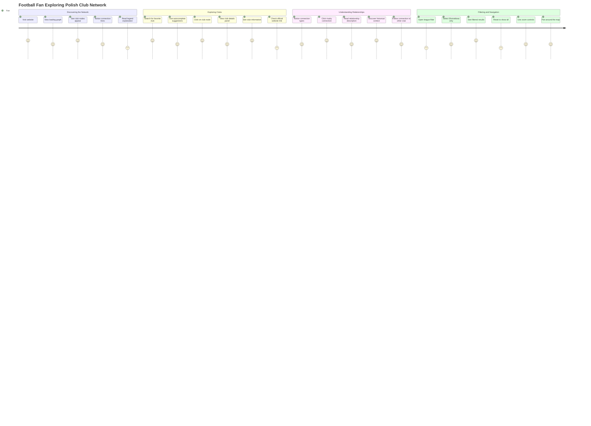
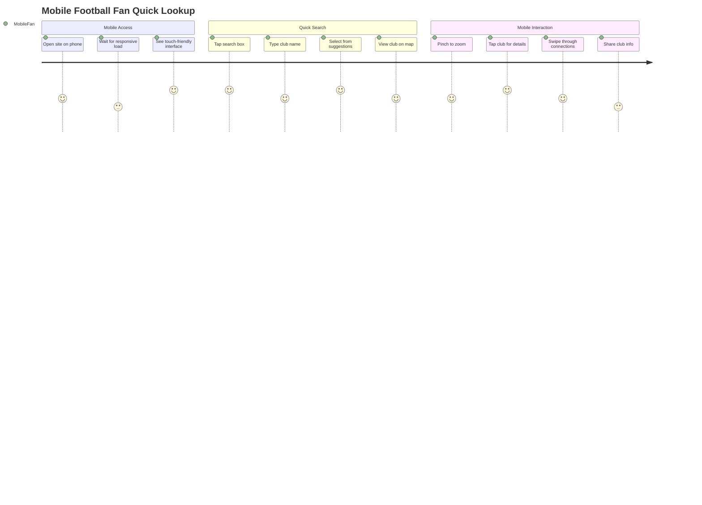
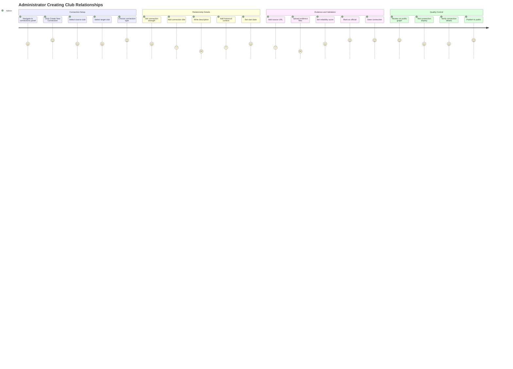
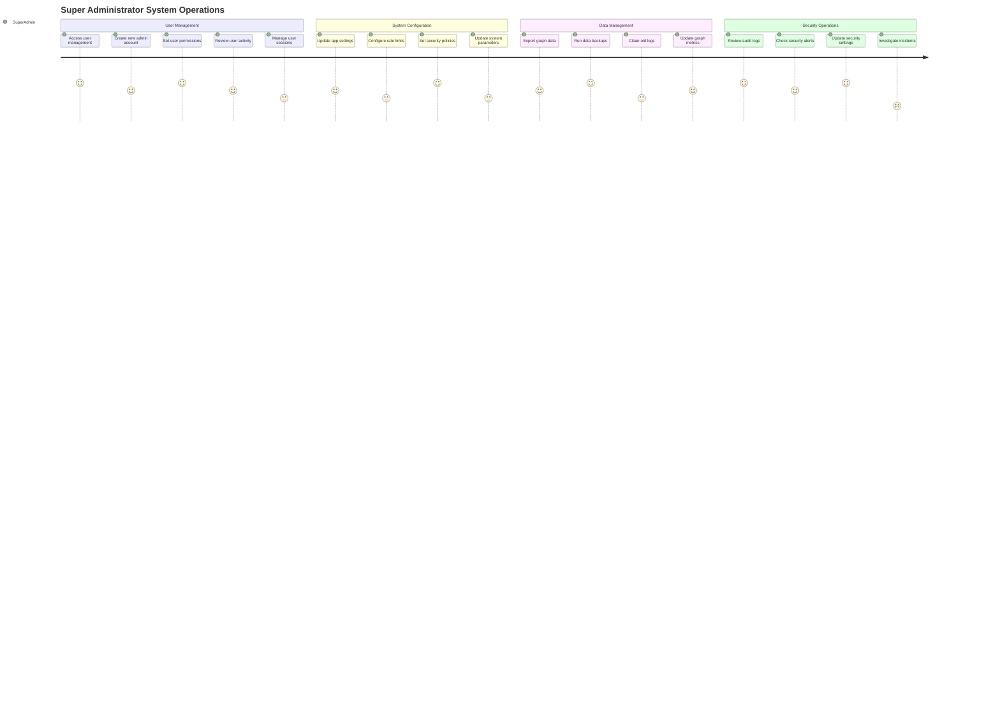
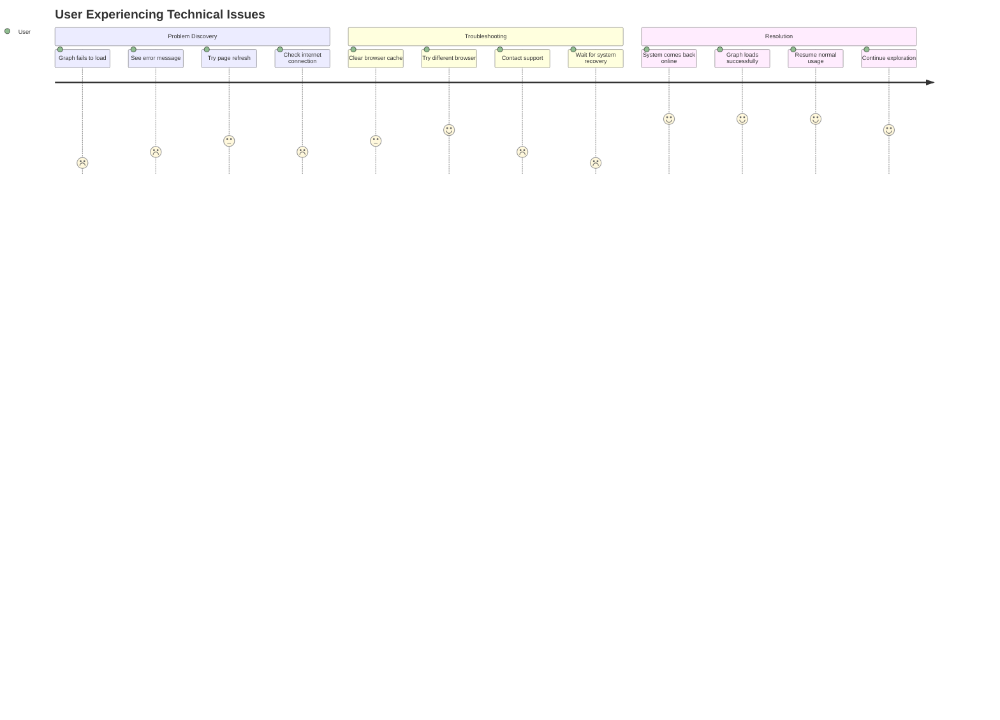
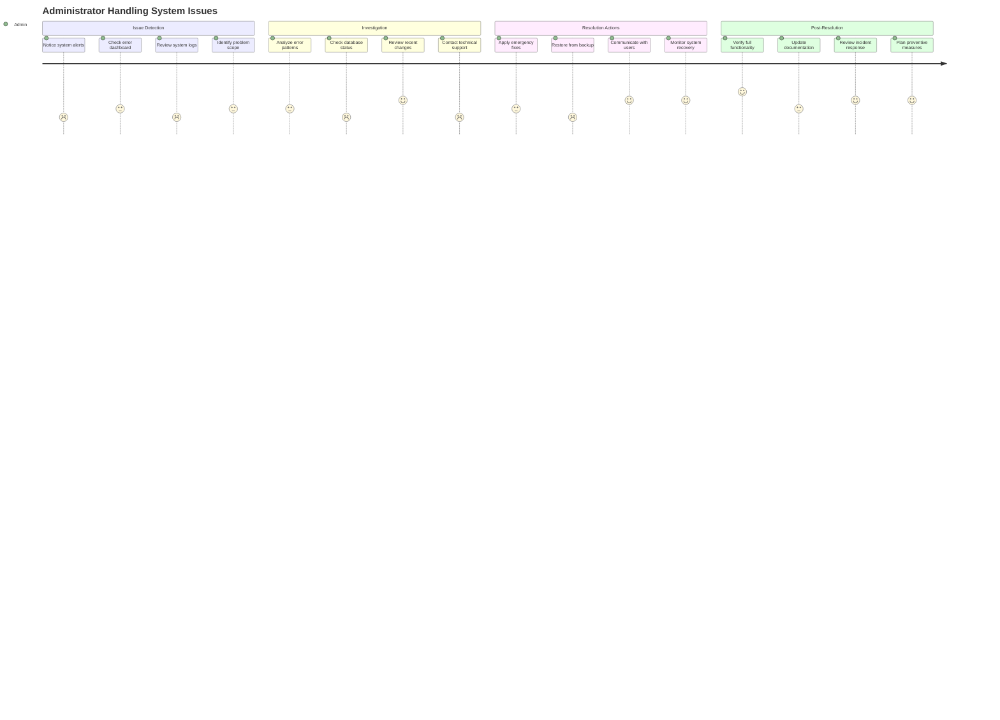

# Polish Football Network - User Journey Maps

This document contains user journey diagrams based on the feature requirements for the Polish Football Network application. The journeys represent the main user flows for both public users (football fans) and administrators.

## Public User Journey - Football Fan Exploring Club Network

## Public User Journey - Mobile Football Fan

## Administrator Journey - Initial Setup

## Administrator Journey - Managing Connections

## Administrator Journey - Daily Management

## Super Administrator Journey - System Management

## Research User Journey - Football Analyst

## Error Recovery Journey - User Facing Issues

## Administrator Error Recovery Journey

## Content Creator Journey - Building Network Data

## User Journey Legend

**Satisfaction Scores:**

- 5: Excellent experience, user feels delighted
- 4: Good experience, user feels satisfied
- 3: Neutral experience, user feels okay
- 2: Poor experience, user feels frustrated
- 1: Terrible experience, user feels angry

**User Types:**

- **Fan**: General public football enthusiast
- **MobileFan**: Mobile device user
- **Admin**: System administrator
- **SuperAdmin**: System super administrator
- **Analyst**: Football researcher/analyst
- **User**: Generic user (during errors)
- **Creator**: Content creator/data entry specialist

## Key Insights from User Journeys

### Pain Points Identified

1. **Loading Performance**: Graph loading time critical for user satisfaction
2. **Mobile Experience**: Touch interactions and responsive design essential
3. **Error Handling**: Need robust error recovery and user communication
4. **Data Quality**: Verification and source validation crucial for credibility
5. **Search Functionality**: Autocomplete and quick lookup highly valued

### Success Factors

1. **Visual Appeal**: Interactive graph creates high engagement
2. **Information Richness**: Detailed club and connection data satisfies researchers
3. **Easy Navigation**: Intuitive filters and controls enhance usability
4. **Administrative Efficiency**: Streamlined content management workflows
5. **System Reliability**: Robust monitoring and recovery procedures

### Optimization Opportunities

1. **Performance**: Focus on sub-3-second loading times
2. **Mobile-First**: Prioritize touch-friendly responsive design
3. **Search Enhancement**: Improve autocomplete and suggestion algorithms
4. **Error Prevention**: Proactive monitoring and user guidance
5. **Content Tools**: Streamline administrative workflows for efficiency

These user journeys reflect the feature requirements and user stories outlined in the original specification, showing how different user types interact with the Polish Football Network application throughout their complete workflows.
